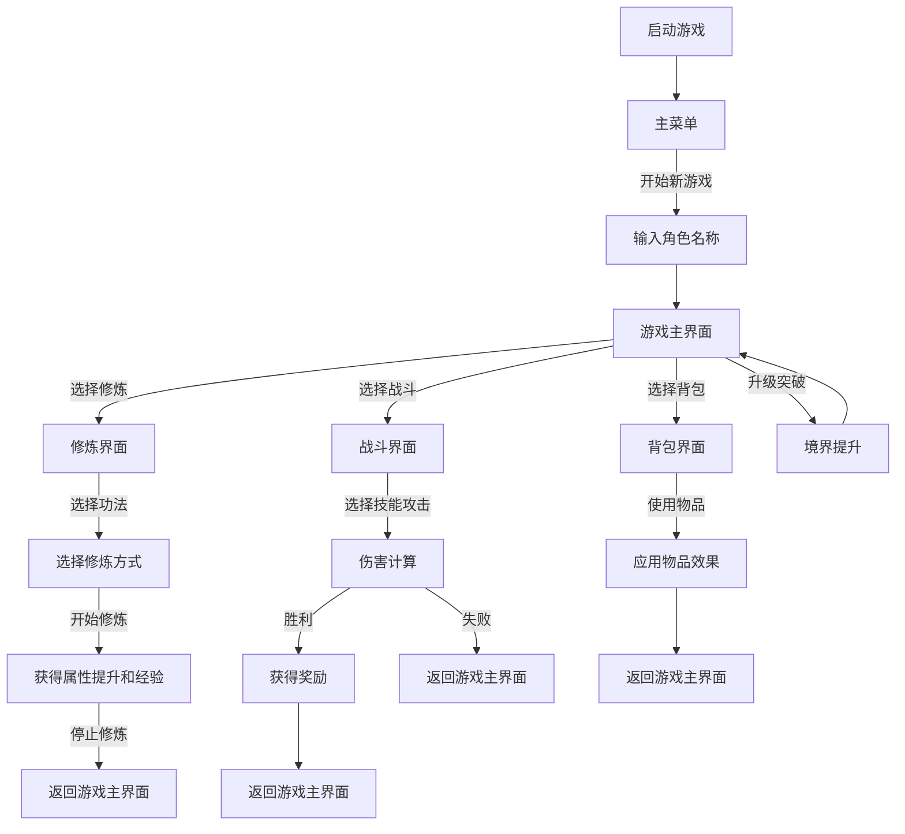
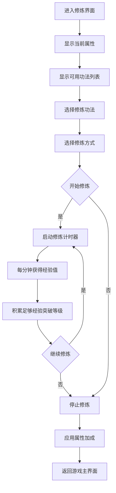
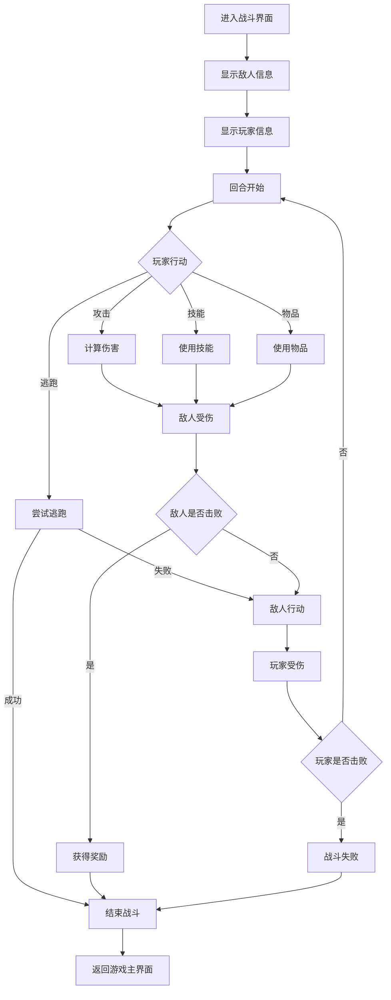
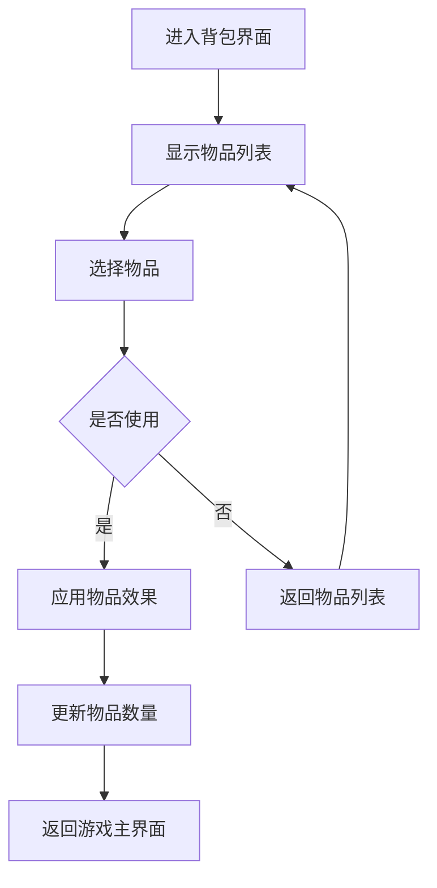

# 修仙奇缘（Trust of Immortality）游戏流程图

## 游戏核心流程

## 详细游戏流程说明

### 1. 游戏启动流程
- 游戏启动 → 检查资源文件是否完整 → 加载主菜单
- 如果资源不完整，显示资源错误界面，提示用户添加必要资源

### 2. 主菜单流程
- 显示游戏标题和菜单选项：开始新游戏、加载游戏、选项、退出
- 玩家选择"开始新游戏" → 输入角色名称 → 创建新角色 → 进入游戏主界面
- 玩家选择"加载游戏" → 显示存档列表 → 选择存档 → 加载游戏数据 → 进入游戏主界面

### 3. 游戏主界面流程
- 显示玩家信息（姓名、境界、等级）
- 显示玩家属性（气力、神识、体魄、命运）
- 显示已学功法列表
- 显示故事内容和可选行动（修炼、战斗、背包）

### 4. 修炼系统流程

#### 修炼方式与效果
- **气元修炼**：气力+3，神识+1
- **心神修炼**：神识+3，气力+1
- **炼体修炼**：体魄+3，气力+1

### 5. 战斗系统流程

### 6. 背包系统流程
